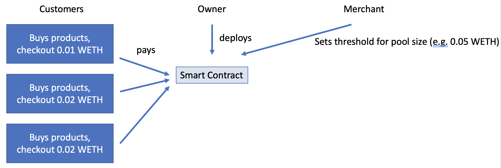
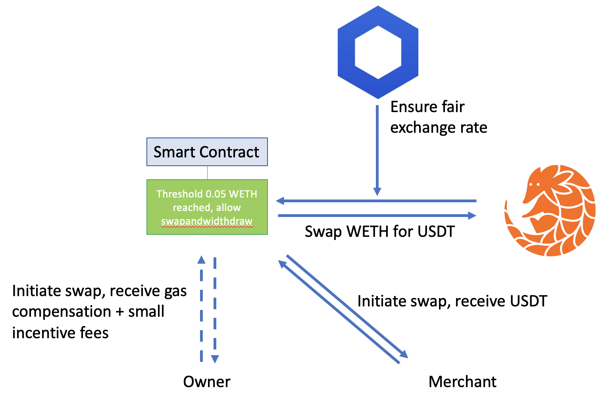

# Payngolinky

Payngolinky is a next-generation e-commerce payment solution that solves the core issue of
cryptocurrency market volatility for merchants who desire to move beyond traditional fiat 
payment systems that are slow and can be subject to crippling inflation.

Merchants are unwilling to accept cryptocurrencies as a form of payment due to the risk of their 
assets fluctuating in value significantly. Payngolinky alleviates their exposure by converting 
the customer's cryptocurrency payments (currently Ethereum) into Tether, whose value is anchored 
to the price of stable national currencies.

This is achieved by swapping Ethereum for Tether on the Pangolin decentralized exchange when an 
optimal pairing is detected. The Pangolin exchange is used since it is built upon the lightning
fast Avalanche framework. Chainlink is integrated to determine the optimal swapping price.

Payngolinky also offers a seamless payment experience for customers who are eager to spend their 
favorite cryptocurrencies. The popular browser wallet extension MetaMask is integrated, enabling 
quick access to assets and security through signed transactions.

# How does it work?

The payments to the merchant are relayed through a smart contract deployed by us/the service provider. 
In the smart contract it is ensured that only the merchant can access the funds. Customers on the merchant's
shop page will purchase items and transfer WETH to the smart contract.

In order to convert the received WETH in to stable USDT, the smart contract can interact with Pangolin
to swap the tokens. Here, Chainlink ensures a fair price for the swap.
While the merchant can initiate swaps and withdrawals at any time, they also setup a threshold
amount of WETH at which the owner is allowed to initiate a swap. This feature is added as the merchant
may not want to manually trigger the swaps to limit cryptocurrency exposure. In order to incentivize
an external party to realize a swap as soon as the threshold is met, the provider gets a reimbursement
which is slightly higher than the gas fees. This way, the contract provider will make sure to initiate
the swap as soon as the threshold is reached to maximize the number of times the fee is paid.

For demonstration purposes this swap functionality is now allowed for any address, not just for the
fixed merchant and owner addresses (that is if any WETH is available on the contract). To test the
contract interactions, it is required to have WETH in the Metamask wallet to pay for the demo products.
The WETH can be swapped for AVAX on the pangolin.exchange on the Fuji network with the token address: 0xFE314b188135893A684EE997eDcb81823Ffb575B.
If the swap is blocked, this may be caused by WETH/USDT price on Pangolin being lower than reported by Chainlink.
As both WETH and USDT (0xaeC89D2e476a57498b2FB661d3B6667C96BbC11a) are on the FUJI network, the price may is not being updated by arbitrageurs.
In case for a swap being blocked, this can be fixed by swapping the appropriate amount of USDT for WETH to increase the WETH price.

## Project Installation

In a terminal, run:

### `$ git clone https://github.com/Payngolinky/shop.git`

This will create a folder named `shop` with the project files.\
Change directory into this folder with `$ cd shop`

This project requires [nodeJS](https://nodejs.org/en/) to be installed.

### `$ npm install`

This command will install all required modules for Payngolinky to run.

## Available Scripts

In the project directory, you can run:

### `npm start`

Runs the app in the development mode.\
Open [http://localhost:3000](http://localhost:3000) to view it in the browser.

### `npm run deploy`

Builds the app for production and deploys to the github site, https://payngolinky.github.io/shop/
